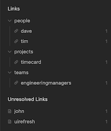
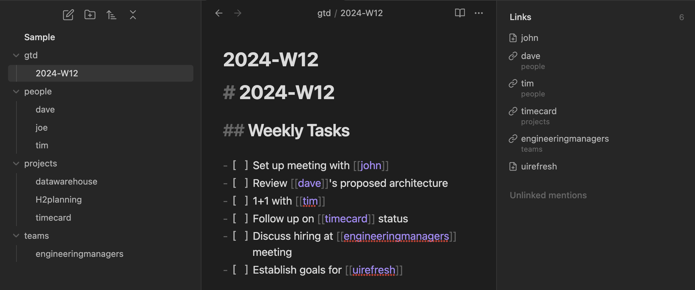
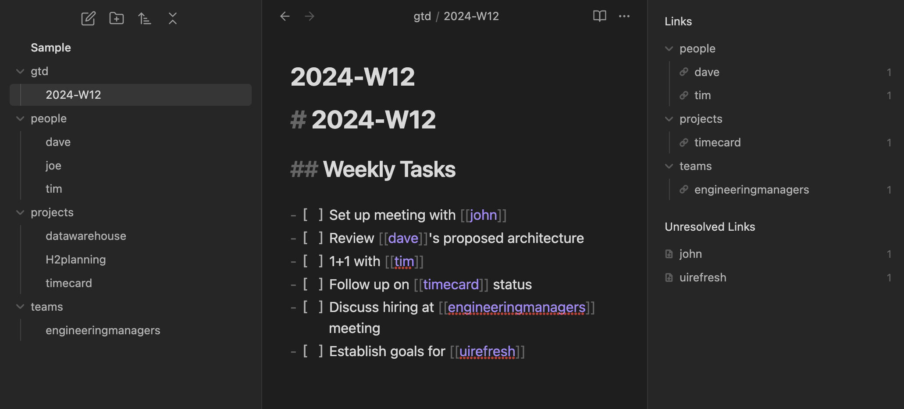
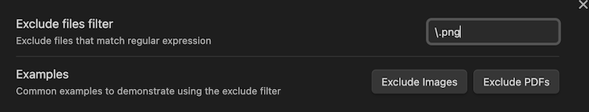

[](../../releases)
[](../../commits/main/)
[](../../issues)
[](../../issues?q=is%3Aissue+is%3Aclosed)
[](/LICENSE)
[](https://obsidian.md/plugins?id=hierarchical-outgoing-links)

# Hierarchical Outgoing Links

## Overview
Displays outgoing links for the active document as a hierarchy based on the folder structure of the references.

 

## Motivation
In the age old folders vs tags debate I tend to lean heavier on physically structuring notes into high level categories. The tag hierarchy display provides a nice overview of tags and how they relate to each other and I wanted something similar that leveraged the folder structure to display outgoing links as a tree.

## Example
Here's a comparison of the core plugin vs the hierarchical outgoing links plugin in action.

This is how the out-of-the-box core outgoing links plugin displays links:


This is how this plugin displays links:
 

## Features
- Collapsable tree structure allows you to easily focus on what what is most important
- Clickable links to references
- List of unresolved links indicating any dangling references which you might want to create.
- Ability to exclude items from the hierarchy using a regular expression

### Filtering
The plugin has the ablity to filter out items in the list based on a regular expression. This comes in handy when you want to remove all images or PDFs from displaying. The exclude filter is configurable in the Settings menu.
 

 When a filter is being applied to the hierarchy a filter icon displays at the top of the plugin.
 

## Commands
The following commands are available in the Obsidian Command Palette:

| Command | Description |
|---------|-------------|
| Show hierarchical outgoing links | Displays the panel in the event it was closed |

## Settings
The following settings are available in the settings window:
| Setting | Description |
|---------|-------------|
| Exclude files filter | A regular expression which will filter out any match. Helpful if you want to remove images and PDFs |

## Development

### Setup
```bash
npm install
```

### Running
```bash
npm run dev
```
<a href="https://www.buymeacoffee.com/jasonmotylinski" target="_blank"></a>